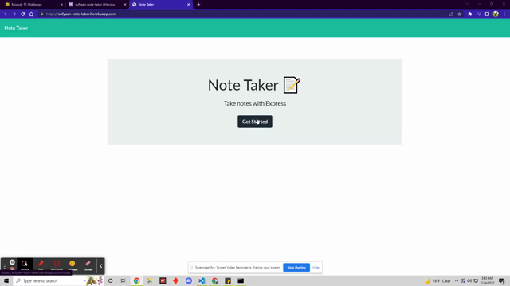
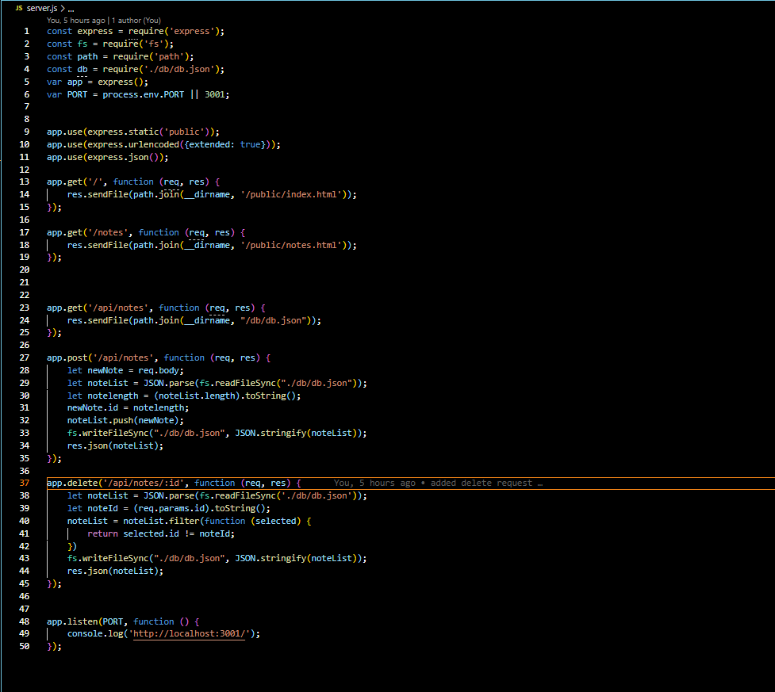

# Note-Taker

# Description
 - This application is a javascript application that is run through Node.js. This application allows you to write down notes and save them to the site. You have the option to delete the note, also reselect the previous note and create multiple notes.
  
 

# Installation
 1. I copied over the starter files
 2. I created the server js file.
 3. I added all the required classes.
 4. I created how the data requested would be handled
 5. I added the get requests for index and the notes files and gave them each their own id.
 6. i created the post request to add the notes to the db file and the write it on the notes files
 7. I  created a way to delete the notes based off their given id's.

## Table of Contents
- [Installation](#installation)

- [Usage](#usage)

- [Contribution](#contribution)

- [Tests](#tests)

- [License](#liscense)

- [Questions](#questions)

# Usage
 - Please refer to the below gif

# contributions
 - Sufyaan Vaidya

# Tests
 - Tests can be ran through Node.JS

# License
 - [This repo is licensed by MIT](https://opensource.org/licenses/MIT)

# Contact and Questions
 - Github: SufyaanVaidya
 - Email: vaidyasufyaan@gmail.com

